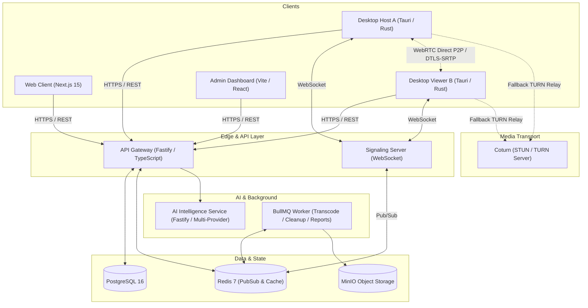

# System Architecture — NexusDesk AI

## Layer Specifications

1. **Native Client Layer**:
   - Built on Tauri 2 with native OS screen capture (DXGI Desktop Duplication on Windows, ScreenCaptureKit on macOS, PipeWire on Linux).
   - Direct hardware-accelerated video encoding, isolated WebRTC data channels, and host-side double policy execution checking.

2. **Signaling & State Plane**:
   - Stateless WebSocket connections backed by Redis PubSub allowing seamless horizontal clustering across multiple instances.

3. **AI Intelligence Engine (Phase 8)**:
   - Decoupled microservice supporting multi-provider fallback (Google Gemini, OpenAI, Anthropic, OpenRouter, and local Ollama).
   - Strict secret scrubbers ensure zero credential leakage.
   - Formal Tool Registry with static risk classifications, execution timeouts, and loop detection.
   - Policy Engine enforcing automation modes (`OBSERVE_ONLY`, `RECOMMEND`, `ASK_BEFORE_ACTION`, `LIMITED_AUTO`).
   - Computer-use safety engine with short-lived control leases, coordinate normalization, and emergency stop.
   - Post-session intelligence report generator grounded in verified telemetry facts.

4. **Observability, Resilience & Deployment Layer (Phase 9)**:
   - Unified `/health`, `/ready`, `/live`, and Prometheus `/metrics` endpoints across all backend services.
   - AlertManager routing critical threshold alerts (>5% error rate, relay latency spikes, connection capacity).
   - Rate limiting and free-demo quota governance (`DEMO_QUOTAS`) protecting public demo instances.
   - Verified automated database backup (`scripts/backup-db.ts`) and recovery (`scripts/restore-db.ts`) runbooks.
   - Release management pipeline (`scripts/release.ts`) and fast rollback automation (`scripts/rollback.ts`).

