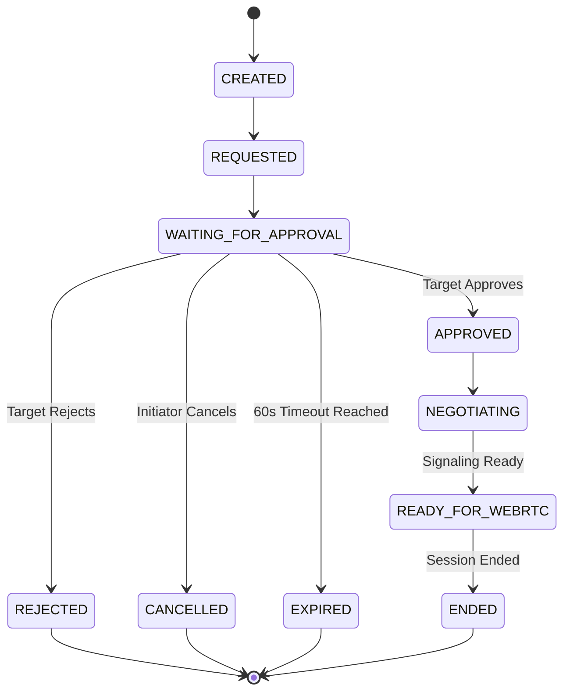

# NexusDesk AI Protocol Specification (v1)

## 1. Real-Time Signaling Event Envelope

All signaling messages over WebSockets follow the versioned event envelope:

```json
{
  "version": 1,
  "eventId": "evt_7f8a9b0c1d2e",
  "type": "session.request",
  "sessionId": "ses_8f9a2b1c4d5e6f7a",
  "timestamp": 1724976000000,
  "sequence": 1,
  "sender": {
    "userId": "usr_9a8b7c6d",
    "deviceId": "dev_1a2b3c4d"
  },
  "payload": { ... }
}
```

---

## 2. Signaling Message Taxonomy

| Message Type               | Sender      | Target    | Purpose                                             |
| :------------------------- | :---------- | :-------- | :-------------------------------------------------- |
| `connection.authenticate`  | Client      | Server    | Supplies JWT access token for socket authentication |
| `connection.authenticated` | Server      | Client    | Confirms authenticated identity binding             |
| `session.request`          | Initiator   | Target    | Requests remote session with requested capabilities |
| `session.requested`        | Server      | Initiator | Confirms session creation with 60s expiration       |
| `session.accept`           | Target      | Server    | Target approves session with granted permissions    |
| `session.accepted`         | Server      | Peers     | Broadcasts session transition to `NEGOTIATING`      |
| `session.reject`           | Target      | Server    | Target rejects connection with structured reason    |
| `session.rejected`         | Server      | Peers     | Notifies initiator of remote rejection              |
| `session.cancel`           | Initiator   | Server    | Initiator cancels pending connection request        |
| `session.cancelled`        | Server      | Peers     | Notifies participants of cancellation               |
| `session.end`              | Participant | Server    | Terminates active remote session                    |
| `session.ended`            | Server      | Peers     | Broadcasts session termination                      |
| `rtc.offer`                | Peer A      | Peer B    | Exchanged during `NEGOTIATING` (WebRTC SDP offer)   |
| `rtc.answer`               | Peer B      | Peer A    | Exchanged during `NEGOTIATING` (WebRTC SDP answer)  |
| `rtc.ice_candidate`        | Peer        | Peer      | Exchanged during negotiation (ICE candidates)       |
| `ai.proposal`              | AI / Host   | Peers     | Broadcasts structured AI action proposal            |
| `ai.approval`              | Human Peer  | AI / Host | Submits user approval or rejection for proposal     |
| `ai.action`                | Host        | Peers     | Broadcasts AI action execution status               |
| `ai.result`                | Host        | AI / Peer | Delivers verified tool execution result             |
| `ai.stop`                  | Any Peer    | All       | Emergency stop signal to halt all AI actions        |
| `heartbeat`                | Client      | Server    | Periodic ping every 25s                             |
| `heartbeat.ack`            | Server      | Client    | Heartbeat response acknowledgement                  |

---

## 3. Remote Session State Machine (Phase 2 & Beyond)



---

## 4. Dedicated WebRTC Data Channels (Future Phase 3+)

| Channel Name | Reliability | Ordered | Max Retransmits | Purpose                                                     |
| :----------- | :---------- | :------ | :-------------- | :---------------------------------------------------------- |
| `control`    | Reliable    | Yes     | 5               | Session handshakes, permission updates, heartbeats          |
| `input`      | Unreliable  | No      | 0               | Ultra low-latency mouse moves, clicks, keyboard events      |
| `clipboard`  | Reliable    | Yes     | -               | Bi-directional text and image clipboard sync                |
| `file`       | Reliable    | Yes     | -               | Chunked file transfer (64KB chunks with SHA-256 validation) |
| `telemetry`  | Unreliable  | No      | 1               | Dynamic CPU, RAM, FPS, and RTT performance metrics          |
| `chat`       | Reliable    | Yes     | -               | Live in-session textual messaging                           |
